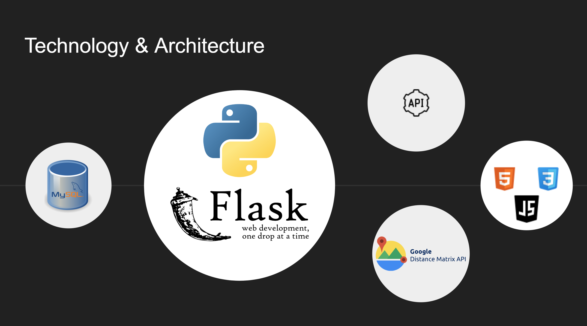
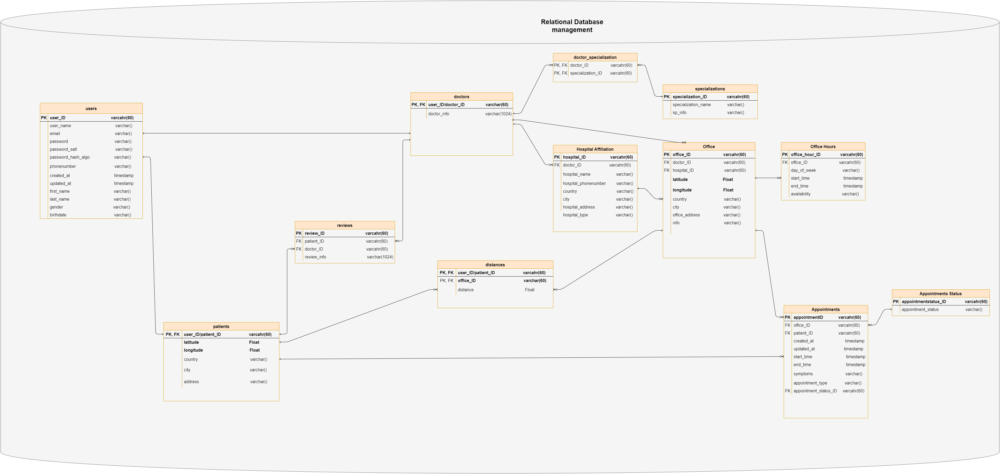

ARC is a Flask web application built with the following technologies:
## Front End:
- **HTML/CSS** for markup and styling of the webpages
- **Javascript** for dynamic content

## REST API Google Distance Matrix API
- GET, POST requests are handeled
- Google Distance Matrix Api is used to compute distance between an origin and destinations

## Database
- MySQL Relationational Database to store data
- Handle database with ORM (SQLAlchemy)

## Back End
- **Flask** web framework based on Python

## Server/Deployment
- 
- 